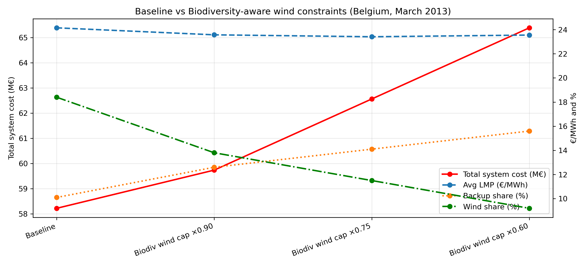

# Biodiversity Constraints and Electricity System Impacts using PyPSA-Eur

## 📌 Overview

This repository contains scenario-based electricity system analysis examining how biodiversity-aware wind constraints affect system costs, electricity prices, renewable penetration, and backup generation within a PyPSA-Eur framework.

The project uses the Belgium electricity system as a case study and investigates both deterministic and stochastic representations of biodiversity-related wind deployment constraints.

The analysis demonstrates how limiting renewable deployment for ecological protection can introduce important trade-offs between:
- biodiversity conservation,
- renewable penetration,
- system reliability,
- and economic efficiency.

---

## 🌍 Research Motivation

Large-scale renewable deployment is central to decarbonization strategies, but renewable infrastructure expansion may also generate ecological and biodiversity-related pressures through:
- land-use change,
- habitat fragmentation,
- visual disturbance,
- and ecosystem disruption.

This project explores the system-level implications of biodiversity-aware renewable constraints by analyzing how reduced wind availability affects electricity system operation and performance.

The repository focuses on understanding how biodiversity protection measures interact with:
- electricity system costs,
- dispatch behavior,
- backup generation requirements,
- and renewable energy integration.

---

## ⚙️ Methodological Overview

The analysis is conducted using solved PyPSA-Eur electricity networks with fixed infrastructure capacities.

Wind generation availability is modified through scaling of renewable availability profiles (`p_max_pu`) to represent biodiversity-related deployment limitations and ecological constraints.

Two complementary approaches are implemented:

### 1. Deterministic Sensitivity Analysis

Wind availability is systematically reduced across predefined scenarios in order to evaluate how the electricity system responds to progressively stricter biodiversity-aware constraints.

### 2. Stochastic Uncertainty Analysis

Monte Carlo-style sampling is used to introduce uncertainty in wind availability, allowing evaluation of:
- operational variability,
- system risk,
- uncertainty bands in system outcomes,
- and sensitivity to weather-driven renewable fluctuations.

To isolate operational effects from investment effects, generation and transmission capacities are frozen at their optimized values. Scenario runs therefore re-optimize dispatch decisions only.

---

## 📊 Key Metrics

System performance is evaluated using:
- Total system cost
- Average locational marginal prices (LMPs)
- Backup generation share
- Wind energy share
- Biodiversity pressure indicators

---

## 🔍 Main Findings

The results indicate that progressively stricter biodiversity-aware wind constraints lead to:

- Higher total system costs
- Reduced wind energy penetration
- Increased reliance on backup generation
- Greater operational uncertainty

At the same time, average electricity prices remain comparatively stable across scenarios, suggesting that biodiversity constraints primarily affect aggregate system costs and dispatch composition rather than short-run price-setting dynamics.

The analysis highlights a clear trade-off between biodiversity protection and renewable system performance. Restricting wind deployment reduces renewable penetration and increases dependence on dispatchable backup technologies, illustrating the importance of complementary flexibility measures such as:
- energy storage,
- interconnection,
- demand-side flexibility,
- and alternative low-impact renewable technologies.

---

## 📊 Biodiversity-aware Wind Constraints

  

  <em>Impact of progressively stricter biodiversity-aware wind constraints on the Belgium electricity system (March 2013). Reduced wind availability increases total system costs and backup generation dependence while lowering wind energy penetration. Average electricity prices remain comparatively stable across scenarios.</em>

---

## 📁 Repository Structure

- `notebooks/` – Main analysis notebook (`energy_mod_BE.ipynb`)
- `scripts/` – Helper functions
- `figures/` – Generated plots

## 🚀 Requirements
- Python 3.10+
- pandas, numpy, matplotlib
- PyPSA / PyPSA-Eur
- HiGHS or Gurobi solver

## 💻 Recommended Environment

The analysis was developed and tested using:

- Ubuntu (WSL2 on Windows)
- VS Code with WSL extension
- PyPSA-Eur managed through `pixi`

Using WSL/Linux is recommended for compatibility with PyPSA-Eur workflows and large-scale energy system modeling.

## 📌 Notes
Large solved network files (`.nc`) and PyPSA-Eur datasets are not included due to file size limitations.  
The analysis assumes access to previously solved PyPSA-Eur network outputs.

## 👤 Author

**Samuel Kwesi Kumi**